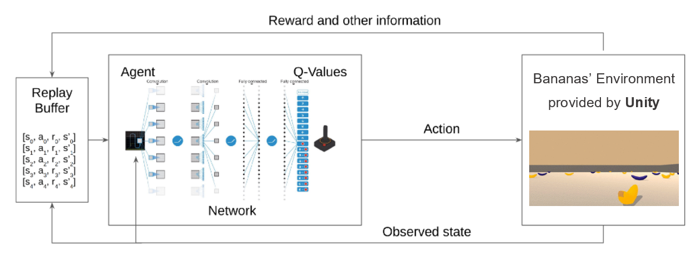

[//]: # (Image References)

# Project Deep Q-Learning: Navigation

### Introduction

**Deep Learning** uses machine learning to make predictions by leveraging vast amounts of training data and a flexible architecture that is able to generalise to previously unseen examples.     
    
In **Reinforcement learning**, the goal is to have an agent learn how to navigate a new enviroment with the goal of maximising cummulative rewards. One approach to this end is **Q-Learning**, where the agent tries to learn the dynamics of the enviroment indirectly by focusing on estimating the value of each state-action pair in the enviroment. This is acheived over the course of training, using it's experiences to produce and improve these estimates.     
    
Please take the time now to read the [research paper](https://storage.googleapis.com/deepmind-media/dqn/DQNNaturePaper.pdf) that introduces the Deep Q-Learning (DQN) algorithm.
    
For this project, you will train an agent to navigate (and collect bananas!) in a large, square world:  

    
The environment is provided by Unity Machine Learning Agents (ML-Agents). This is an open-source plugin that enables games and simulations to serve as environments for design, train, and evaluate intelligent agents. In this project, we are using the version v0.4 interface.     
In the figure is show how the Agent interact with the Environment:

A reward of +1 is provided for collecting a yellow banana, and a reward of -1 is provided for collecting a blue banana.  Thus, the goal of your agent is to collect as many yellow bananas as possible while avoiding blue bananas.  

The state space has 37 dimensions and contains the agent's velocity, along with ray-based perception of objects around agent's forward direction.  Given this information, the agent has to learn how to best select actions.  Four discrete actions are available, corresponding to:
- **`0`** - move forward.
- **`1`** - move backward.
- **`2`** - turn left.
- **`3`** - turn right.

The task is episodic, and in order to solve the environment, your agent must get an average score of +13 over 100 consecutive episodes.

### Getting Started

Step 1: Clone the DRLND Repository
If you haven't already, please follow the instructions in the DRLND GitHub repository to set up your Python environment. These instructions can be found in README.md at the root of the repository. By following these instructions, you will install PyTorch, the ML-Agents toolkit, and a few more Python packages required to complete the project.

(For Windows users) The ML-Agents toolkit supports Windows 10. While it might be possible to run the ML-Agents toolkit using other versions of Windows, it has not been tested on other versions. Furthermore, the ML-Agents toolkit has not been tested on a Windows VM such as Bootcamp or Parallels.

Step 2: Download the environment from one of the links below.  You need only select the environment that matches your operating system:    
    - Linux: [click here](https://s3-us-west-1.amazonaws.com/udacity-drlnd/P1/Banana/Banana_Linux.zip)    
    - Mac OSX: [click here](https://s3-us-west-1.amazonaws.com/udacity-drlnd/P1/Banana/Banana.app.zip)    
    - Windows (32-bit): [click here](https://s3-us-west-1.amazonaws.com/udacity-drlnd/P1/Banana/Banana_Windows_x86.zip)     
    - Windows (64-bit): [click here](https://s3-us-west-1.amazonaws.com/udacity-drlnd/P1/Banana/Banana_Windows_x86_64.zip)       

### Instructions

Follow the instructions in `Navigation.ipynb` to get started with training your own agent!  

Then, place the file in the `p1_navigation/` folder in the DRLND GitHub repository, and unzip (or decompress) the file.  

## What files are included

### ipynb files
As stated above train_agent.ipynb and test_agent.ipynb are intuitive files that are all that's required to walk you through training or testing this agent. If however you would like to change the code (such as to specify a different model architecture, or hyperparameter selection) then you may find the following descriptions useful:

### report.md
This describes the implementation in detail beyond the scope of this readme. Read this file if you'd like to know more about: the model architecture, the DQN algorithm itself and the hyperparameters used, the modifications made such as Dual DQN and prioritised replay, or the suggestions for further work.

### model.py
This is a simple python script that specifies the pytorch model architecture used. For this project the architecture is quite straightforward, a simple feed-forward neural network with linear layers. Added complexity however comes from the Duel-DQN implementation, which causes the computational graph to fork into state values and state-action values before recombining.

### dqn_agent.py
This file contains all of the functions required for the agent to store experience, sample and learn from it, and select actions in the enviroment. There is also a lot of extra complexity in this coode due to the prioritised experience replay and double DQN implementations.

### checkpoint.pth
This file contains the trained weights of the most recently trained agent. You can use this file to straight away test an agent without having to train one yourself.

### References

+ Sutton, Richard & Barto, Andrew. [Reinforcement Learning: An introduction](https://s3-us-west-1.amazonaws.com/udacity-drlnd/bookdraft2018.pdf).   
+ Hongzi Mao?, Mohammad Alizadeh?, Ishai Menache†, Srikanth Kandula†. [Resource Management with Deep Reinforcement Learning](http://people.csail.mit.edu/hongzi/content/publications/DeepRM-HotNets16.pdf).
