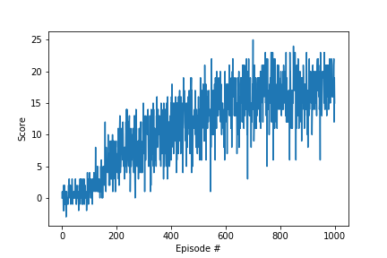
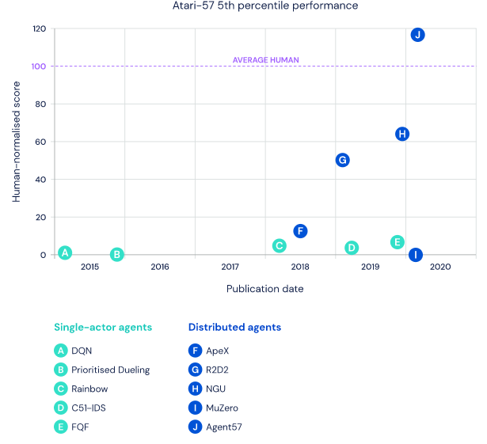

# Project report

## Learning algorithm

The learning algorithm used to solve Unity environment (bananas) is **Deep Q-Network (DQN)**.     
     
As an input the vector of state is used instead of an image so convolutional neural nework is replaced with deep neural network. 
The deep neural network has following layers:    
- Layer = input: 37 (state size) -> output: 64    
- Layer = input: 64 -> output: 32    
- Layer = input: 32 -> output: 4(action size)    
     
Unfortunately, reinforcement learning is notoriously unstable when neural networks are used to represent the action values. 
Then, to improve the algorithm some extensions to the Deep Q-Networks (DQN) have been developed.     
Each extension address a different issue with the original DQN algorithm:    
  1 - Double DQN    
  2 - Prioritized Experience Replay    
  3 - Dueling DQN    
  4 - Multi-step bootstrap targets    
  5 - Distributional DQN    
  6 - Noisy DQN    
    
Researchers at Google DeepMind tested the performance of an agent that incorporated all six of these modifications.     
The corresponding algorithm was termed **Rainbow**.    

### Parameters used in the algorithm:
   
- Maximum number of training episodes:    
**n_episodes (int)= 1000**    
- Maximum number of timesteps per episode:    
**max_t (int)= 500**    
- Starting value of epsilon, for epsilon-greedy action selection:    
**eps_start (float)= 1.0**    
- Minimum value of epsilon:    
**eps_end (float)= 0.01**    
- Multiplicative factor (per episode) for decreasing epsilon:    
**eps_decay (float)= 0.995**    
- Whether to implement Double_DQN modification:    
**Double_DQN (bool)= True**    
- Whether to implement Priority_Replay modification:    
**Priority_Replay (bool)= True**    
- Whether to implement Duel_DQN modification:    
**Duel_DQN (bool)= True**    
- E adds to all priorities, which are raised to power of a, while b is used to de-bias the q-updates:    
**Priority_Replay_Paras (list of e,a,b floats)= [0.5, 0.5, 0.5]**    

BUFFER_SIZE = int(1e5)  # replay buffer size    
BATCH_SIZE = 64         # minibatch size    
GAMMA = 0.99            # discount factor    
TAU = 1e-3              # for soft update of target parameters    
LR = 5e-4               # learning rate     
UPDATE_EVERY = 4        # how often to update the network    

**GAMMA (float): discount rate**\
Close to 1 will cause the agent to value all future rewards equally, while close to 0 will cause the agent to prioritise more immediate rewards. Unlike most hyperparameters, this will not only effect convergence but also the optimal policy converged to. For example if an agent must choose between collecting 1 bananna and then waiting 20 timeseteps versus collecting 2 banannas after 20 timesteps, then the optimal policy depends on the reard discount rate. Close to 1 is often best so I chose 0.99.


**LR (float): model hyperparameter - learning rate**\
This determines how large the model weight updates are after each learning step. Too large and instability is caused, while too small and the model may never converge. I chose the small 5e-4, since we can increase epsiodes until we reach convergence. 

**BATCH_SIZE (int): model hyperparameter - number of experiences sampled for a model minibatch**\
Too low will cause learning instability and poor convergence, too high can cause convergence to local optima. I chose 64 as a default.


**BUFFER_SIZE (int): replay buffer size**\
this is the size of the experience buffer, which when exceeded will drop old experiences. This is mainly limited by your available RAM - if you experience issues with RAM try lowering it


**TAU (float): how closely the target-network should track the current network**\
After every learning step the target-network weights are updated closer to the current network, so that the target-network weights are a moving average over time of the current network past weights. i chose a relatively small value (1e-3) although haven't experimented with tuning it.

**UPDATE_EVERY (int): how often to update the network**\
How many steps should pass before an update of the current network takes place. I chose every 4 timesteps.

## Results

```
Episode 100	Average Score: 0.19
Episode 200	Average Score: 1.38
Episode 300	Average Score: 5.51
Episode 400	Average Score: 8.90
Episode 500	Average Score: 11.13
Episode 600	Average Score: 14.67
Episode 637	Average Score: 15.02
Environment solved in 537 episodes!	Average Score: 15.02
Episode 700	Average Score: 15.54
Episode 800	Average Score: 15.26
Episode 900	Average Score: 17.20
Episode 1000	Average Score: 16.41
```
    
    
### Trained agent


## Ideas for future work

Agent57, the first deep reinforcement learning agent to obtain a score that is above the  human baseline on all 57 Atari 2600 games.
Agent57 combines an algorithm for efficient exploration with a meta-controller that adapts the exploration and long vs. short-term behaviour of the agent.
Agent57 is also a distributed RL agent that decouples the data collection and the learning processes.



FIGURE 2. AGENTS THAT USE A DISTRIBUTED SETUP ARE BLUE, WHEREAS SINGLE-ACTOR AGENTS ARE TEAL. THE 5TH PERCENTILE ANALYSIS SHOWS THAT STATE OF THE ART ALGORITHMS SUCH AS MUZERO AND R2D2 PERFORM DRAMATICALLY BELOW THE HUMAN BENCHMARK (PURPLE DOTTED LINE), WHEREAS AGENT57 PERFORMS BETTER THAN HUMANS ON THE HARDEST ATARI GAMES.

## References:
+ AGENT57 deep reinforcement learning agent. (https://deepmind.com/blog/article/Agent57-Outperforming-the-human-Atari-benchmark)


