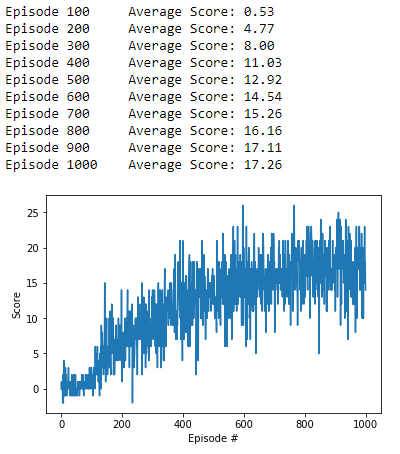
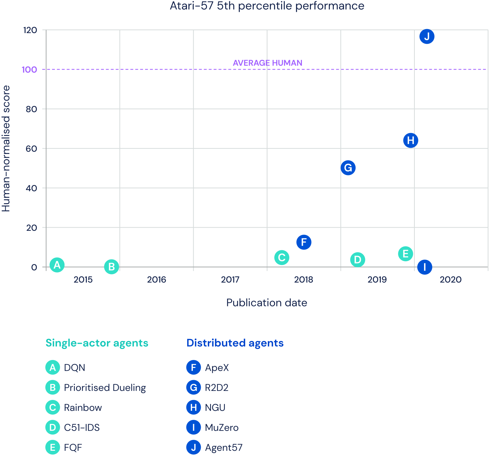

# Project report

## Learning algorithm

The learning algorithm used is Deep Q-Network (DQN) to solve Unity environment.     
     
As an input the vector of state is used instead of an image so convolutional neural nework is replaced with deep neural network. 
The deep neural network has following layers:

- Layer = input: 37 (state size) -> output: 64
- Layer = input: 64 -> output: 32
- Layer = input: 32 -> output: 4(action size)

Unfortunately, reinforcement learning is notoriously unstable when neural networks are used to represent the action values. 
Then, to improve the algorithm some extensions to the Deep Q-Networks (DQN) have been developed.
Each extension address a different issue with the original DQN algorithm:
1 Double DQN
2 Prioritized Experience Replay
3 Dueling DQN
4 Multi-step bootstrap targets
5 Distributional DQN
6 Noisy DQN

Researchers at Google DeepMind tested the performance of an agent that incorporated all six of these modifications. 
The corresponding algorithm was termed Rainbow.

### Parameters used in the algorithm:
   
- Maximum number of training episodes:    
**n_episodes (int)= 1000**    
- Maximum number of timesteps per episode:    
**max_t (int)= 500**    
- Starting value of epsilon, for epsilon-greedy action selection:    
**eps_start (float)= 1.0**    
- Minimum value of epsilon:    
**eps_end (float)= 0.01**    
- Multiplicative factor (per episode) for decreasing epsilon:    
**eps_decay (float)= 0.995**    
- Whether to implement Double_DQN modification:    
**Double_DQN (bool)= True**    
- Whether to implement Priority_Replay modification:    
**Priority_Replay (bool)= True**    
- Whether to implement Duel_DQN modification:    
**Duel_DQN (bool)= True**    
- E adds to all priorities, which are raised to power of a, while b is used to de-bias the q-updates:    
**Priority_Replay_Paras (list of e,a,b floats)= [0.5, 0.5, 0.5]**    


## Results



```
Episode 100	Average Score: 0.19
Episode 200	Average Score: 1.38
Episode 300	Average Score: 5.51
Episode 400	Average Score: 8.90
Episode 500	Average Score: 11.13
Episode 600	Average Score: 14.67
Episode 637	Average Score: 15.02
Environment solved in 537 episodes!	Average Score: 15.02
Episode 700	Average Score: 15.54
Episode 800	Average Score: 15.26
Episode 900	Average Score: 17.20
Episode 1000	Average Score: 16.41
```

### Trained agent


## Ideas for future work

Agent57, the first deep reinforcement learning agent to obtain a score that is above the  human baseline on all 57 Atari 2600 games.
Agent57 combines an algorithm for efficient exploration with a meta-controller that adapts the exploration and long vs. short-term behaviour of the agent.
Agent57 is also a distributed RL agent that decouples the data collection and the learning processes.



https://kstatic.googleusercontent.com/files/a49ca0d1257a35500661d1e03a64f09df15e573fbcb1d97c623894554cb613b53a23ca235e640adb3939dee3b2dbd19f318c308b525f10dbe5a4fedef4ddf3f3


